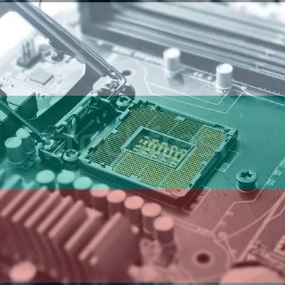

# Stani-Bogat

  

  

This is a discord chatting bot for playing quiz game, reproduction of the popular "Who Wants to Be a Millionaire" game.
The bot asks questions, give jokers, displays general or user statistics and runs utility for adding questions.

`Note: Currently the bot user interface is avaible only for bulgarian speakers!`

## Project

### 1. Dependencies

  
  
  

The whole code in the project is written in **Python**.
For connecting the Discord API is used [discord.py](https://github.com/Rapptz/discord.py "Popular Discord API wrapper written in Python").
**Dropbox API** is used for storing and accessing the whole data in one place in the Dropbox cloud. Also other Python modules are used.

### 2. Running enviorment

  

Firstly the bot was hosted on [Heroku](https://www.heroku.com).
Currently the bot is hosted on [Google Cloud](https://cloud.google.com) with the Compute Engine and basic VM instance.

### 3. Community

  

This project was popularized and polished with the invaluable support of the [IT Bulgaria Discord server](http://discord.gg/dRrdYQf "Largest IT bulgarian Discord server").
Due to the contributing nature of the project and easy to use question addition utility, there are more than 10 question authors and ~600 questions in ~15 different categories.

## How to play

To start a new game you should send the new game command in discord channel. After sending the command the bot responds and sends the first question. It adds emojis of letters on the message of the question, with these the player can sumbit his answer.

  

## Statistics

## Utility for question add

## Credits
